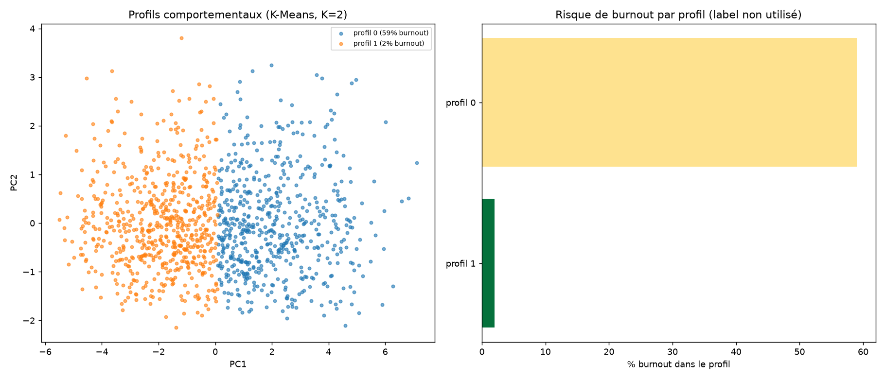
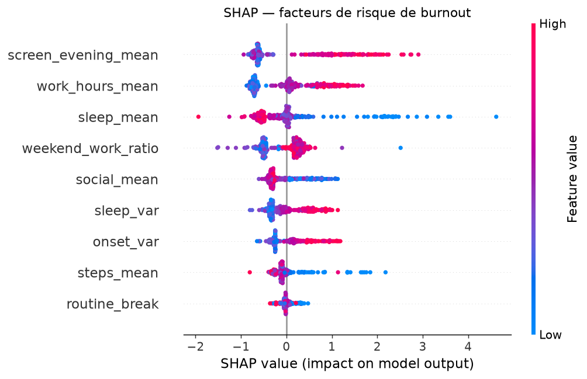

# Prédiction du risque de burnout à partir de données comportementales

> ⚠️ **Outil d'alerte précoce (RH / bien-être), pas un diagnostic médical.**
> Données **entièrement synthétiques**. Ce projet met délibérément en avant les
> **enjeux de vie privée et de biais** : la section *Limites & éthique* fait
> partie intégrante du livrable.

Repérer, à partir de signaux comportementaux (temps d'écran, travail, sommeil,
mobilité, sociabilité), des **profils à risque de surcharge** avant qu'ils ne
deviennent critiques — de façon **explicable** et **actionnable**.

---

## 1. Problème & angle décisionnel

Le burnout s'installe progressivement et laisse des traces comportementales
(sur-travail, doomscrolling nocturne, sommeil dégradé, retrait social) avant de
devenir critique. L'objectif : détecter ces signaux tôt, avec un score
**transparent** que la personne peut comprendre et sur lequel elle garde le
contrôle — pour orienter vers du soutien, **jamais** vers de la sanction.

## 2. Données

Aucun jeu réel de traces comportementales brutes labellisées n'est éthiquement
exploitable publiquement. On **simule** un jeu avec une structure causale
explicite (`src/generate.py`) :

- **1 200 personnes × 56 jours** = 67 200 observations quotidiennes.
- Un **stress latent caché** par personne génère les comportements du jour
  (travail ↑, écran du soir ↑, sommeil ↓ et plus irrégulier, coucher plus tardif,
  pas ↓, messages sociaux ↓, travail le week-end ↑).
- Le **label de burnout** (~29 % de prévalence) est tiré d'une fonction
  logistique des **comportements réellement observés** sur la fenêtre — pas du
  latent — pour que le signal soit *récupérable* comme dans un vrai système.
- *Prêt pour du réel* : le pipeline accepte un jeu proche (ex. *Mental Health in
  Tech Survey*, *Employee Burnout*) en remplaçant `load_daily()`.

## 3. Méthodologie

| Étape | Module | Contenu |
|---|---|---|
| Génération | `src/generate.py` | Traces quotidiennes + label causal |
| Features | `src/features.py` | 9 indicateurs (surcharge / récupération / régularité) par personne, sans fuite |
| Profils | `src/clustering.py` | **K-Means** (K par silhouette) + **Ward** en contrôle |
| Score | `src/model.py` | **Gradient Boosting** vs LogReg, ROC/PR-AUC |
| Explicabilité | `src/model.py` | **SHAP** global (beeswarm/bar) + local (waterfall) |

Deux familles de techniques (au-delà du requis) : **clustering non supervisé**
+ **classification supervisée**, avec **explicabilité** SHAP.

## 4. Résultats clés

### Profils comportementaux (non supervisé, label non utilisé)

| Profil | N | Travail | Écran soir | Sommeil | **% burnout** |
|---|---|---|---|---|---|
| Surchargé | 574 | 7,9 h | 3,3 h | 6,0 h | **59 %** |
| Équilibré | 626 | 6,8 h | 2,3 h | 6,6 h | **2 %** |

Une segmentation **purement comportementale** sépare déjà fortement le risque.

### Score de risque supervisé (test tenu à l'écart)

| Modèle | ROC-AUC | PR-AUC |
|---|---|---|
| LogReg (balanced) | 0,96 | 0,91 |
| Gradient Boosting | 0,95 | 0,89 |

La parité LogReg/GB indique un signal largement **linéaire et interprétable**.

### Facteurs de risque dominants (SHAP)
Écran du soir → heures de travail → manque de sommeil → travail le week-end →
retrait social. Tous **actionnables** (hygiène numérique, charge, récupération).

| | |
|---|---|
|  |  |

## 5. Limites & éthique *(centrales pour ce projet)*

**Données**
- **Entièrement synthétiques** : les performances élevées reflètent en partie la
  structure causale encodée. Sur données réelles (bruitées, confondues), les
  scores seraient plus bas et les biais bien présents.

**Éthique & vie privée — non négociable**
- **Surveillance intrusive** : suivre écran/mobilité/sommeil n'est acceptable
  qu'avec **consentement explicite**, contrôle par la personne, minimisation et
  traitement local/chiffré.
- **Finalité de soutien uniquement** : prévention et accompagnement, **jamais**
  sanction, tri RH ou décision d'emploi.
- **Biais & faux positifs** : généralisation incertaine (âge, culture,
  neurodiversité) ; un faux positif peut stigmatiser. Score explicable, seuil
  transparent et **humain dans la boucle** obligatoires.
- **Pas un diagnostic** : le burnout est clinique ; l'outil signale un *risque
  comportemental* à confronter à un accompagnement humain qualifié.

## 6. Reproduction

```bash
conda create -n burnout python=3.11 -y && conda activate burnout
pip install -r requirements.txt

python src/generate.py    # traces comportementales + label
python src/features.py    # features par personne
python src/clustering.py  # profils non supervisés
python src/model.py       # score de risque + SHAP
python notebooks/build_notebook.py
```

`random_state=42` partout ; sorties régénérées dans `reports/`.

## 7. Structure du repo

```
06-burnout-risk-behavioral/
├── data/raw/behavioral_daily.csv   # données synthétiques (~4 Mo, versionnées)
├── notebooks/
│   ├── 06_burnout_risk.ipynb
│   └── build_notebook.py
├── src/
│   ├── generate.py   features.py
│   ├── clustering.py model.py
├── reports/
│   ├── figures/       # profils, dendrogramme, SHAP
│   └── *.csv          # profils, métriques, importance SHAP
├── README.md
└── requirements.txt
```
